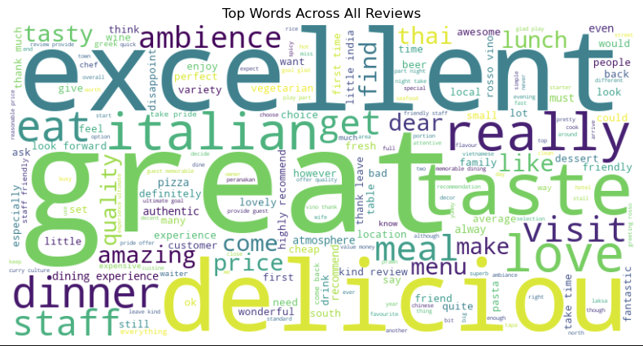
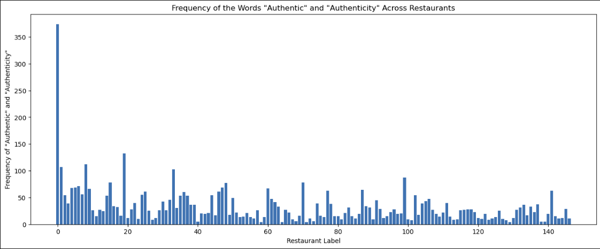

# Authentic Food places
by Liyena Yusoff

## Background

In recent years, Singapore has experienced a surge in fusion cuisine, blending international flavors with local delicacies. While this culinary trend has gained popularity, it raises concerns about preserving the authenticity and traditional essence of local dishes.

Amidst this dynamic gastronomic landscape, there's a delicate balance to be struck. Fusion cuisine caters to those who appreciate international twists, drawing attention to Singapore's culinary scene globally. However, this shift also prompts reflection on the preservation of authentic local experiences.

The ongoing dialogue between fusion and tradition reflects diverse culinary preferences. While some gravitate towards the exciting blend of international flavors, others seek authentic tasting food true to the essence of their cultural roots. Navigating this intricate interplay between innovation and tradition becomes crucial in defining Singapore's culinary identity.

## Problem statement

With the growing challenge of finding truly authentic food, this project aims to recommend authentic dining experiences based on consumer preferences and support rstaurants in enhancing the authenticity and quality of their offerings through customer feedback analysis, including key words, and Net Promoter Scores (NPS).

This addresses the difficulty customers face in navigating a culinary landscape where traditional flavors may be diluted or overshadowed by modern interpretations.

## Objectives

- Analyze TripAdvisor restaurant reviews to identify their sentiments for the authenticity of the dishes.
- Develop a NPS-like score to rank restaurants.
- Develop a model that could classify TripAdvisor reviews into detractor or promoter of the restaurant.
- Provide actionable insights for both consumers seeking authentic experiences and restaurants aiming to highlight their authenticity.

## Success metrics

- F1-score

### Notebooks

[Part I - Data cleaning and pre-processing](data_clean.ipynb)

[Part II - Exploratory Data Analysis](eda.ipynb)

[Part III - Modelling](preprocess_model.ipynb)

[Part IV - App data training](streamlit/rag_finetuning.ipynb)

To run the [restaurantchat.py](streamlit/restaurantchat.py) app, these [json files](https://drive.google.com/drive/folders/17CKD5UZqIqVPZhp5Vc3fnxN7WTkVoNCt?usp=drive_link) are needed in this [folder](/streamlit/data/index.vecstore).

## Data

TripAdvisor Restaurant reviews

## Workflow
1. Data Scraping
2. Data Cleaning
3. Exploratory Data Analysis
4. Preprocessing and modelling
5. App data training
6. App deployment

## Summary

This is a NLP project that involves topic modeling and supervised learning involving machine learning classifiers. The best performing model was found to be XGBoost with a F1 score of 0.90.

## Notebooks

[1_Data_Cleaning.ipynb](notebooks/data_clean.ipynb)

[2_EDA.ipynb](notebooks/eda.ipynb)

[3_Modelling.ipynb](notebooks/preprocess_model.ipynb)

[4_App_Data_Trainig.ipynb](streamlit_deploy/rag_finetuning.ipynb)

## Data Dictionary

|column|type|description|
|-----------|----------------|-------------|
|review_text|string|cleaned and lemmatized reviews|
|restaurant_label|integer|representing each restaurant; ranging from 0 to 146|
|overall_score|float|similarity score of the topic labels associated with the reviews|
|sentiment|integer|NPS-like classes; 0 for detractor, 1 for promoter|

## Data Cleaning and Preprocessing
The review texts were lemmatized without including the stopwords.

## Exploratory Data Analysis (EDA)

## Methodology

1. Sentiment Analysis
To identify the authenticity of the food by the restaurants, I did sentiment analysis on the reviews. By having a breakdown of the sentimenst, I obtained the top words associated to each sentiment to look out for sentiments with the word 'authentic'.

2. Topic modeling with BERT 
By specifying the topic or theme, the cosine similarity score of each review is obtained with respect to each topic-food, service, ambiance, authentic. These scores are then aggregated to produce an overall score which indicates the similarity of the reviews to all the topics. The scores are then used to obtain a score for each of the restaurant, acting like an NPS-like score.

3. Text Classification into two classes - promoter or detractor. 
Using the overall cosine similarity score, reviews with > 0.3 score are promoters while the rest are detractors. Machine learning models are used to train on these data to classify the reviews.

While getting the top words from the sentiment analysis, most of the reviews seldom mention about the authenticity of the dishes, rather, more about the overall experience at the restaurant. It is a challenge to determine which restaurant offers authentic food with little reviews mentioning about the food authenticity.

## Evaluation

**1. Classifier models**

|vectorizer|classifier|f1_train|f1_test|
|----------|----------|----------|----------|
|TF-IDF|Logistic Regression|0.99898|0.89608|
|**TF-IDF**|**XGBoost**|**0.94997**|**0.89454**|
|TF-IDF|XGBoost|0.94837|0.89400|
|TF-IDF|Logistic Regression|0.98602|0.89191|
|Count Vectorizer|Multinomial Naive Bayes|0.91391|0.87308|
|TF-IDF|Multinomial Naive Bayes|0.99806|0.84533|
|TF-IDF|Random Forest|0.72504|0.81488|
|TF-IDF|Random Forest (baseline)|0.73618|0.78897|

XGBoost is the best classifying model with an F1 test score that can classify 90% of the reviews correctly.

**2. RAG**

- faithfulness score: 0.9125

- answer_relevancy: 0.9643

## App GIF

## Limitations

1. Bias in Online Reviews

Online reviews may be biased and subjective. Reviewers who take the time to leave reviews may not represent the entire customer base, leading to a potential bias in the collected data.

2. Vague Food Descriptions

Reviewers often employ subjective terms such as 'nice' and 'average tasting,' resulting in vague descriptions of the food. This inherent ambiguity may pose challenges in extracting precise insights into customer sentiments regarding specific dishes and their authenticity.

3. Dependency on Periodic NPS Score Checks

The determination of Net Promoter Scores (NPS) is contingent upon periodic checks as it relies on customer reviews. Regular evaluations are necessary for an updated NPS score, requiring the restaurant to allocate resources for consistent reevaluation over time.

4. App Limited to Trained Data

The application's functionality is constrained by the dataset it was initially trained on. In practical terms, this means that the app might not be able to answer questions that is out of the scope of the trained data. This limitation underscores the importance of periodic updates to the training data to ensure the model's adaptability to evolving trends and emerging patterns.

## Recommendations

**For customers/reviewers:**

Enrich Descriptions with Detail

When sharing your culinary experiences, delve into the intricacies of each dish by providing vivid and detailed descriptions. Instead of generic terms, explore rich language to articulate the unique flavors, textures, and aromas. For instance, describe an authentic dish like nasi lemak as having a rich coconut milk-flavored rice, complemented by a sweet yet mildly spicy sambal, and accompanied by crispy, tender chicken.

**For Restaurants/Businesses:**

1. Cultural Events and Collaborations

Incorporating cultural events and collaborations can enrich the dining experience. Consider hosting themed events that celebrate the diverse culinary landscape, fostering community engagement and reinforcing the authenticity of your establishment.

Consider taking part in events such as the Singapore Food Festival that celebrates the diverse culinary landscape or showcase the authenticity of the restaurant's menu through food Expos, reinforcing the authenticity of the establishment.

2. Actively Seeking Customer Feedback on Food Authenticity

Establish accessible channels for patrons to share their experiences, providing valuable insights that contribute to the ongoing improvement of the restaurant's offerings. This dynamic engagement not only ensures customer satisfaction but also demonstrates a dedicated commitment to delivering genuine and authentic dining experiences.

## Conclusion

While the reviews provide only a modest insight into restaurants exclusively focused on authentic cuisine, they unmistakably highlight a discernible demand for traditional dishes. Despite fusion twists, patrons consistently value and seek authentic food experiences. This dual narrative underscores the evolving palate, emphasizing the potential for restaurants to cater to diverse preferences by seamlessly blending innovation with cherished traditional flavors.

## Future work

**1. Cuisine Classification Enhancement**

Enhance the application's analytical depth by incorporating data on the type of cuisines offered by each restaurant, providing a more nuanced understanding of customer preferences and potentially influencing NPS scores.

**2. Experiment with Prompt Engineering**

This entails exploring varied prompt structures, such as explicitly mentioning context or using system messages, to guide the model's behavior. The goal is to enhance contextual understanding, reducing confusion and providing users with a more refined and context-aware conversational experience.

**3. Real-Time NPS Score Monitoring**

Explore the implementation of real-time Net Promoter Score (NPS) monitoring within the application, allowing businesses to proactively track customer satisfaction and make timely adjustments.
    
## Acknowledgments
Kishan S. for scraping the TripAdvisor reviews and for the app data training codes.
